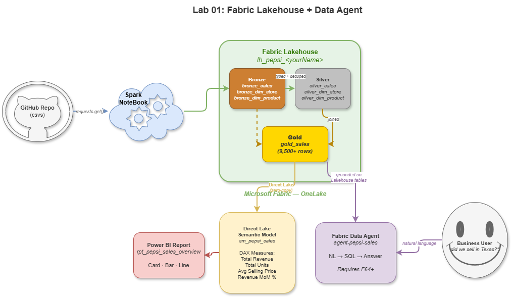
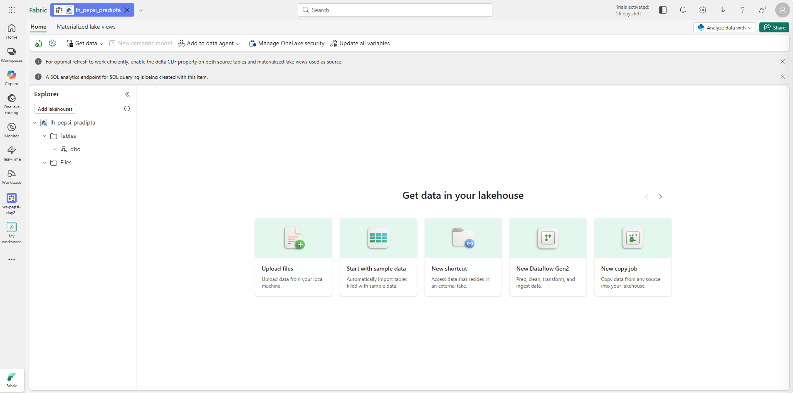
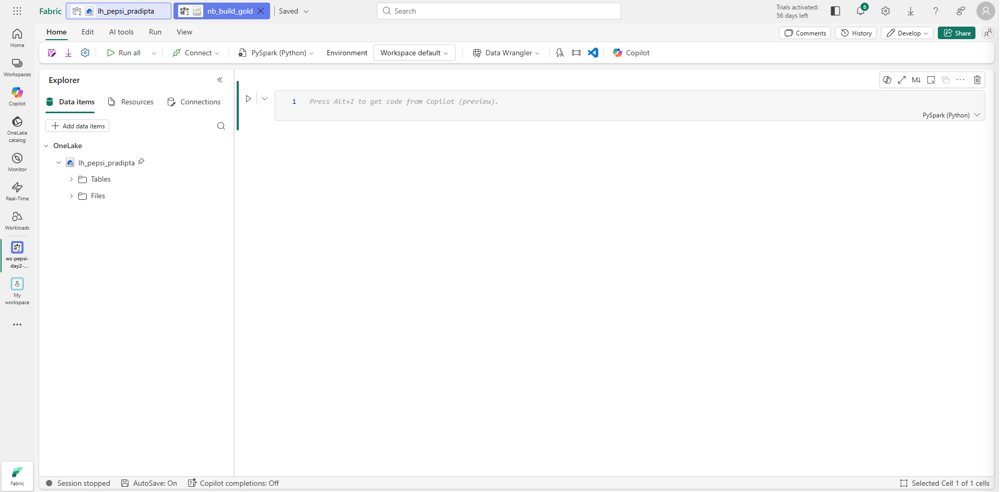
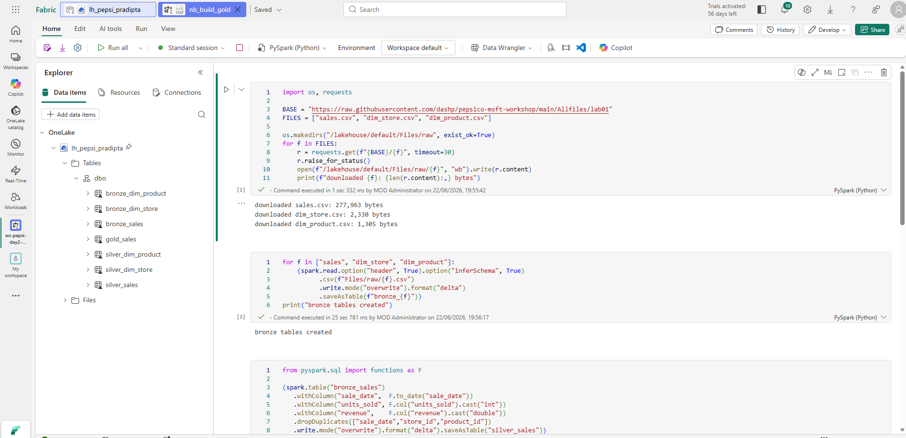
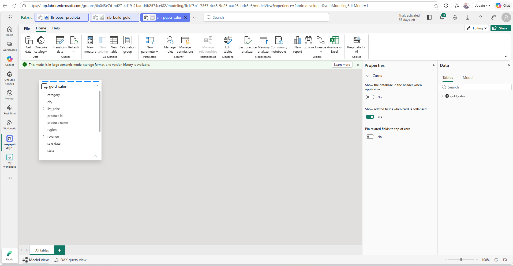
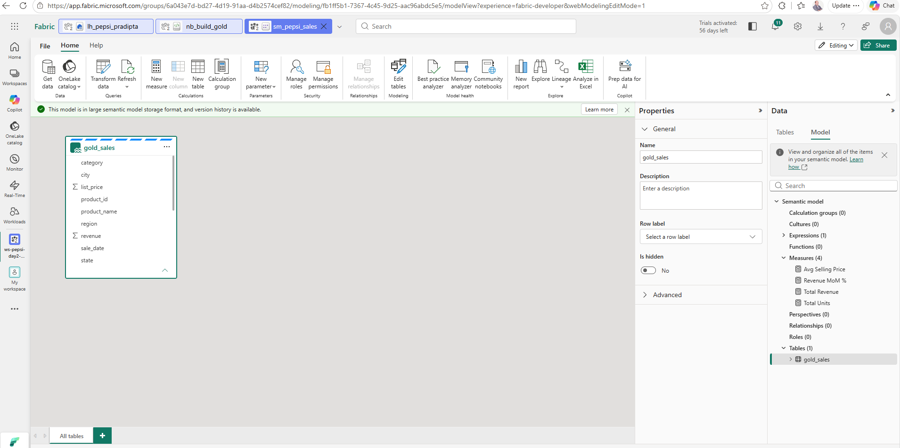
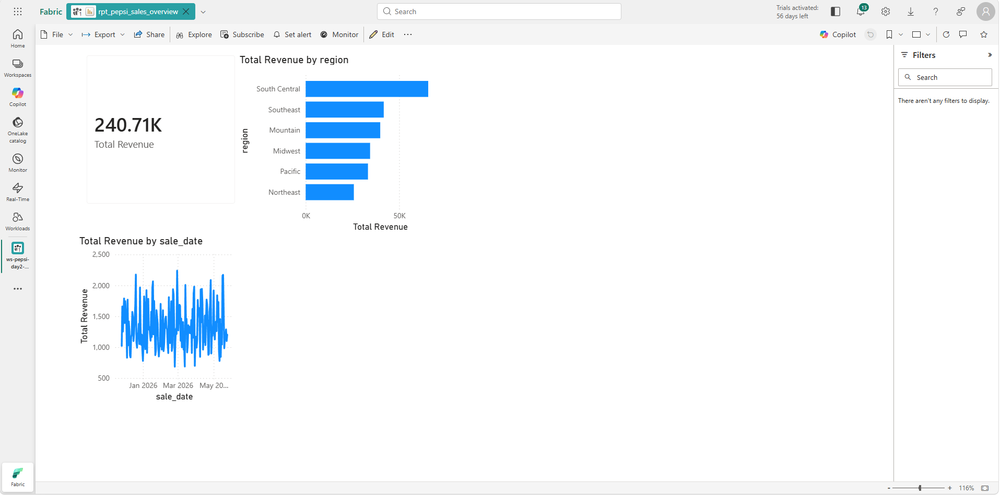
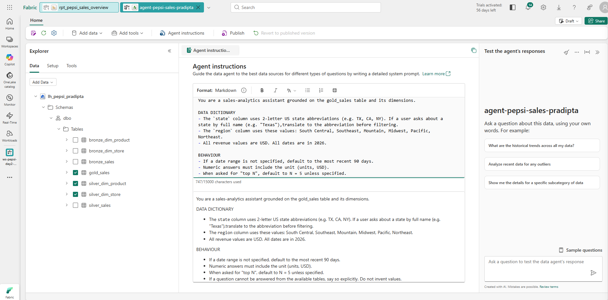
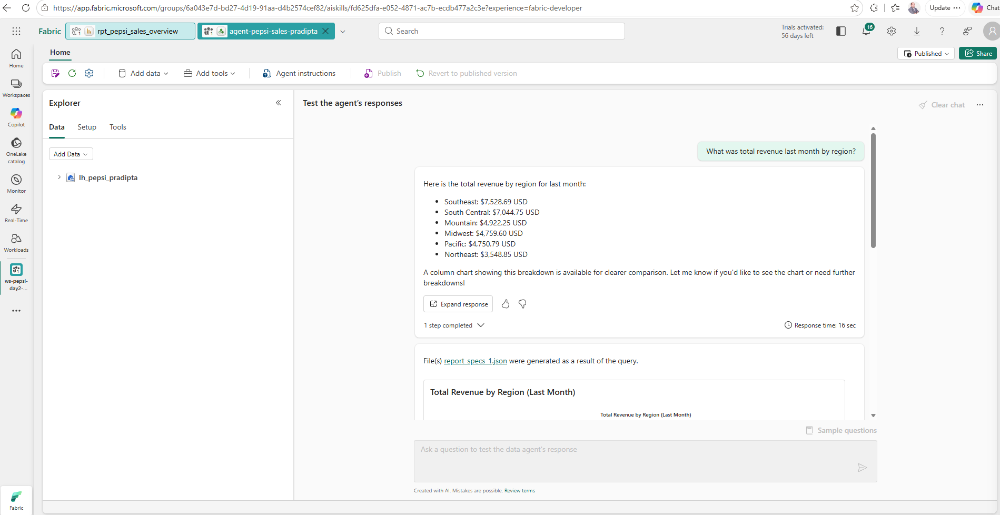

# Lab 01: Build a Fabric Lakehouse and a Fabric Data Agent

## Lab introduction

In this lab you learn to build a complete data product in **Microsoft Fabric**. You will ingest sample retail data into a **Lakehouse** using a Spark notebook, curate it through Bronze → Silver → Gold tables, expose it through a **Direct Lake Power BI semantic model**, and finally create a **Fabric Data Agent** that answers natural-language questions over the curated tables.

The Data Agent you build in this lab is consumed by the Day 2 *Agentic RAG with Foundry IQ + Data Agent + Tools* lab.

This lab requires an Azure subscription and a Microsoft Fabric capacity. You may change the region, but the steps are written using **Sweden Central**.

> **Capacity note**: Task 5 (Fabric Data Agent) requires Fabric capacity **F64 or higher**, or a **Fabric Trial** capacity. If your workshop is on **F2-F32**, the trainer will scale the capacity to F64 before Task 5 starts. Tasks 1-4 run fine on any SKU.

## Prerequisites — verify before you start

- [ ] You can sign in to `https://app.fabric.microsoft.com` with your workshop account.
- [ ] You have a **Fabric** or **Power BI Pro** license assigned (check at `https://myaccount.microsoft.com → Subscriptions`). Without one you will hit `AppMetadataInaccessible` when opening a workspace.
- [ ] You can see the workshop's Fabric capacity in your workspace dropdown.

## Estimated timing: 60 minutes

## Lab scenario

Your organization wants a single place where the demand-planning team can ask plain-English questions about retail sell-through and where downstream AI agents can ground their answers on the same data. You will build the data product end-to-end, validate it visually in Power BI, and expose it as a Fabric Data Agent.

## Architecture diagram



## Job skills

- Task 1: Create a Fabric workspace and Lakehouse.
- Task 2: Ingest sample data and build Bronze → Silver → Gold tables.
- Task 3: Build a Direct Lake semantic model with DAX measures.
- Task 4: Create a quick Power BI report.
- Task 5: Create and test a Fabric Data Agent.
- Task 6: Validate and hand off to Day 2.

---

## Task 1: Open your pre-provisioned workspace and create a Lakehouse

The workshop organizers have pre-provisioned **one Fabric workspace per attendee**, each pre-bound to the workshop's Fabric capacity and with you as **Admin**. You will work entirely inside your own workspace.

> Your workspace name was given to you on a handout (e.g. `ws-pepsi-day2-jdoe`). The `<yourId>` suffix in the rest of this lab refers to that same suffix — use it consistently for every artifact you create.

1. Sign in to the **Microsoft Fabric portal** — `https://app.fabric.microsoft.com`.

2. In the left navigation, select **Workspaces**, and open **`ws-pepsi-day2-<yourId>`** from the list.

    > If you cannot see your workspace, paste the **WorkspaceUrl** from your handout directly into the browser. If that still fails, ask the workshop team — your access has not been provisioned.

    > **Trainer / dry-run only**: If you are testing this lab outside the workshop and no workspace has been pre-provisioned, create one yourself: left nav → **Workspaces** → **+ New workspace** → name `ws-pepsi-day2-<yourId>` → expand **Advanced** → **License mode: Fabric capacity** → pick the workshop capacity → **Apply**. Then continue with step 4.

3. Confirm at the top of the workspace that it is bound to a Fabric capacity (a capacity badge is shown next to the workspace name). You do **not** need to create a workspace or pick a capacity.

4. From your workspace, click **+ New item**, search for **Lakehouse**, and select it.

5. **Name** the Lakehouse `lh_pepsi_<yourId>`, then click **Create**.

6. Confirm the Lakehouse explorer opens with empty `Files/` and `Tables/` sections.

    

---

## Task 2: Ingest sample data and build Bronze, Silver and Gold tables

In this task, you will use a single Spark notebook to download the workshop sample CSVs into Lakehouse `Files/`, then build curated Delta tables.

1. From your workspace, select **+ New item**, choose **Notebook**, and name it `nb_build_gold`.

2. In the notebook's left panel, click **Add Lakehouse**, select `lh_pepsi_<yourId>`, and **set it as the default Lakehouse** by selecting the radio button next to its name. Confirm the radio button is filled (⬤) — only the *default* lakehouse mounts at `/lakehouse/default/`.

    > **If you skip "set as default"**: the notebook will look attached and the Files browser will work, but Spark cells will fail with `Operation failed: "Bad Request", 400, HEAD ... user/trusted-service-user/Files/raw/...`. The path containing `user/trusted-service-user/` is the giveaway — Spark fell back to a session-local namespace because no default lakehouse was set.

    

3. Paste the following cell into the first code cell and run it. This downloads the three workshop CSVs into `Files/raw/`.

    ```python
    import os, requests

    BASE = "https://raw.githubusercontent.com/dashp/pepsico-msft-workshop/main/Allfiles/lab01"
    FILES = ["sales.csv", "dim_store.csv", "dim_product.csv"]

    os.makedirs("/lakehouse/default/Files/raw", exist_ok=True)
    for f in FILES:
        r = requests.get(f"{BASE}/{f}", timeout=30)
        r.raise_for_status()
        open(f"/lakehouse/default/Files/raw/{f}", "wb").write(r.content)
        print(f"downloaded {f}: {len(r.content):,} bytes")
    ```

4. Add a new cell and run it. This creates the **Bronze** tables (raw CSVs persisted as Delta).

    ```python
    for f in ["sales", "dim_store", "dim_product"]:
        (spark.read.option("header", True).option("inferSchema", True)
              .csv(f"Files/raw/{f}.csv")
              .write.mode("overwrite").format("delta")
              .saveAsTable(f"bronze_{f}"))
    print("bronze tables created")
    ```

5. Add a new cell and run it. This creates the **Silver** tables (typed, deduplicated).

    ```python
    from pyspark.sql import functions as F

    (spark.table("bronze_sales")
       .withColumn("sale_date",  F.to_date("sale_date"))
       .withColumn("units_sold", F.col("units_sold").cast("int"))
       .withColumn("revenue",    F.col("revenue").cast("double"))
       .dropDuplicates(["sale_date","store_id","product_id"])
       .write.mode("overwrite").format("delta").saveAsTable("silver_sales"))

    spark.table("bronze_dim_store").write.mode("overwrite").format("delta").saveAsTable("silver_dim_store")
    spark.table("bronze_dim_product").write.mode("overwrite").format("delta").saveAsTable("silver_dim_product")
    print("silver tables created")
    ```

6. Add a final cell and run it. This builds **`gold_sales`**, the analytics-ready fact joined with dimensions.

    ```python
    from pyspark.sql import functions as F

    gold = (spark.table("silver_sales").alias("s")
              .join(spark.table("silver_dim_store").alias("st"),   "store_id",   "left")
              .join(spark.table("silver_dim_product").alias("p"),  "product_id", "left")
              .select(
                  F.col("s.sale_date"),
                  F.col("s.store_id"), F.col("st.store_name"), F.col("st.city"),
                  F.col("st.state"),   F.col("st.region"),
                  F.col("s.product_id"), F.col("p.product_name"),
                  F.col("p.category"),  F.col("p.sub_category"),
                  F.col("p.list_price"),
                  F.col("s.units_sold"),
                  F.col("s.revenue"),
              ))

    gold.write.mode("overwrite").format("delta").saveAsTable("gold_sales")
    print("gold_sales rows:", spark.table("gold_sales").count())
    ```

7. In the Lakehouse explorer, expand **Tables** and confirm all seven Delta tables are present.

    > **If you don't see them**: the Lakehouse explorer does **not** auto-refresh after Spark writes. Click the **⋮** next to **Tables** → **Refresh**, or hit **F5**.
    >
    > **If you see a `dbo` folder under Tables**: your lakehouse is *schema-enabled* (a newer Fabric feature). All seven tables will be **under** `dbo`. This is normal and changes nothing for the rest of the lab — code that references `bronze_sales` etc. still resolves correctly.

    

8. **Click** the `gold_sales` table name in the explorer (single-click). A preview opens in the main canvas. Confirm rows render with **all 13 joined columns**: `sale_date`, `store_id`, `store_name`, `city`, `state`, `region`, `product_id`, `product_name`, `category`, `sub_category`, `list_price`, `units_sold`, `revenue`.

---

## Task 3: Build a Direct Lake semantic model with DAX measures

In this task, you will create a Direct Lake semantic model so Power BI and the Data Agent can query the same curated tables with zero data movement.

1. From the Lakehouse view, in the top-right toolbar, click **New semantic model**.

2. Specify:

    | Setting | Value |
    |---|---|
    | Name | `sm_pepsi_sales` |
    | Tables | `gold_sales` (selected) |

3. Click **Confirm**. The web modeller opens.

    

4. In the model view, select **+ New measure** and add the following measures one at a time.

    > **How the measure editor works**: The **Name** field is in the **Properties panel on the right**, separate from the **Formula** field at the top. **Type the formula manually** and dismiss IntelliSense popups with **Esc** — if you accept an autocomplete suggestion of a measure name while editing that same measure, you will create a **circular dependency** error.
    >
    > After typing the formula, **verify the Name** in the Properties panel matches what you intended before clicking away. If it still says `Measure` (the default), rename it.

    | # | Name (Properties panel) | Formula |
    |---|---|---|
    | 1 | `Total Units` | `SUM(gold_sales[units_sold])` |
    | 2 | `Total Revenue` | `SUM(gold_sales[revenue])` |
    | 3 | `Avg Selling Price` | `DIVIDE([Total Revenue], [Total Units])` |
    | 4 | `Revenue MoM %` | See block below |

    Formula for measure 4:

    ```dax
    VAR _curr = [Total Revenue]
    VAR _prev =
        CALCULATE ( [Total Revenue],
                    DATEADD ( gold_sales[sale_date], -1, MONTH ) )
    RETURN DIVIDE ( _curr - _prev, _prev )
    ```

5. Confirm each measure shows a green checkmark after creation.

    

---

## Task 4: Create a quick Power BI report

1. From the semantic model header, click **Create report**.

2. Build three visuals by dragging fields from the data pane:

    | Visual | Field |
    |---|---|
    | Card | `[Total Revenue]` |
    | Stacked bar | `[Total Revenue]` by `region` (descending) |
    | Line chart | `[Total Revenue]` by `sale_date` |

    > **Tip for the line chart**: After dropping `sale_date` on the X-axis, click the field's dropdown in the visualizations pane and switch from **Date hierarchy** to **Month** (or use the Date hierarchy and drill up to month). The default daily grain produces ~150 noisy points that are hard to read in a demo.

3. **Save** the report as `rpt_pepsi_sales_overview`.

    

---

## Task 5: Create and test a Fabric Data Agent

In this task, you will create a Fabric Data Agent grounded on your curated Lakehouse tables, and ask it natural-language questions.

> **Capacity requirement**: This task requires Fabric capacity **F64 or higher** (or a Fabric Trial capacity). If `+ New item` does not show **Data agent**, ask the trainer to scale the workshop capacity up.
>
> **Naming note**: Fabric Data Agent UI naming has shifted across releases. If you don't see **Data agent** in the **+ New item** menu, look for **AI skill**. The behaviour is the same.

1. From your workspace, select **+ New item**, search for **Data agent**, and name it `agent-pepsi-sales-<yourId>`.

2. In the agent designer, click **Add data source**. Select **Lakehouse**, then choose `lh_pepsi_<yourId>`.

3. In the **Select tables** dialog, select `gold_sales`, `silver_dim_store`, and `silver_dim_product`. Click **Add**.

    > If your tables appear with a `dbo_` prefix (schema-enabled lakehouse), that is normal — pick them as listed.

    

4. In the **Instructions** pane, paste the following. **The DATA DICTIONARY section is critical** — without it the agent will fail on prompts that use full state names like "Texas" because the underlying data is stored as 2-letter codes.

    ```text
    You are a sales-analytics assistant grounded on the gold_sales table
    and its dimensions.

    DATA DICTIONARY
    - The `state` column uses 2-letter US state abbreviations (e.g. TX, CA,
      NY). If a user asks about a state by full name (e.g. "Texas"),
      translate to the abbreviation before filtering.
    - The `region` column uses these values: South Central, Southeast,
      Mountain, Midwest, Pacific, Northeast.
    - All revenue values are USD. All dates are in 2026.

    BEHAVIOUR
    - If a date range is not specified, default to the most recent 90 days.
    - Numeric answers must include the unit (units, USD).
    - When asked for "top N", default to N = 5 unless specified.
    - If a question cannot be answered from the available tables, say so
      explicitly. Do not invent values.
    ```

5. Click **Save**, **then click Publish** (top toolbar).

    > **Save vs Publish**: *Save* persists your edit. *Publish* makes it effective at runtime. Until you click **Publish**, the test pane on the right will still use the previously published version of your instructions — so any prompt you run will appear to ignore your changes. **Always publish after editing instructions.**

6. Run the following prompts one at a time in the test pane and confirm a sensible answer. The first prompt will take 20-30 seconds (cold start); subsequent prompts respond in 5-15 seconds.

    | Prompt | Expected behaviour |
    |---|---|
    | `What was total revenue last month by region?` | 6 regions grouped, sorted desc, with USD unit |
    | `Which product had the highest units sold in the last 30 days?` | Single product + units |
    | `Show me the top 5 stores by revenue this quarter.` | 5-row ranked table |
    | `How many distinct products did we sell in Texas?` | Single number (the DATA DICTIONARY translates Texas → TX) |

    

7. If a prompt fails or returns "no data" when you expect data:
    - Confirm you clicked **Publish** after the last instruction edit.
    - Confirm the right tables are listed under the data source on the left.
    - Try rephrasing using exact column codes (e.g. `TX` instead of `Texas`) to isolate whether the issue is the agent's translation or the data itself.

---

## Task 6: Validate and hand off to Day 2

Confirm each item below before leaving the lab.

- [ ] `gold_sales` has ~30,000 rows with joined dimension columns.
- [ ] Semantic model `sm_pepsi_sales` is in **Direct Lake** storage mode (semantic model settings → **Storage mode**).
- [ ] Four DAX measures evaluate without errors.
- [ ] Power BI report renders three visuals.
- [ ] Data Agent answers all four test prompts.

### Hand-off to Day 2

The Data Agent `agent-pepsi-sales-<yourId>` is now available for the Day 2 lab **Agentic RAG with Foundry IQ + Data Agent + Tools**. To allow Sandeep's Foundry agent to call it, share the Fabric workspace with the Foundry agent's managed identity at the **Viewer** role.

```bash
# Optional — example using Fabric REST API (requires a Fabric admin token)
# Replace placeholders before running.
curl -X POST "https://api.fabric.microsoft.com/v1/workspaces/<workspaceId>/roleAssignments" \
  -H "Authorization: Bearer <token>" \
  -H "Content-Type: application/json" \
  -d '{ "principal": { "id": "<foundry-mi-objectId>", "type": "ServicePrincipal" }, "role": "Viewer" }'
```

---

## Review

In this lab you built a complete Fabric data product — a Lakehouse with medallion architecture, a Direct Lake semantic model with DAX measures, a Power BI report, and a Fabric Data Agent that grounds natural-language answers on your curated tables. You also confirmed that the agent is consumable by a downstream Foundry agent in Day 2.

## Troubleshooting

| Symptom | Likely cause | Fix |
|---|---|---|
| `requests` 404 on the GitHub raw URL | Workshop repo URL not updated | Replace `<your-org>` in the cell with the workshop repo path given on Day 1 |
| Notebook can't write to `Files/` | Default Lakehouse not attached | Left panel → **Add Lakehouse** → set as default |
| Tables don't appear in the Lakehouse explorer after Spark cells succeed | Fabric UI does not auto-refresh the table tree | Click the **⋮** next to **Tables** → **Refresh**, or hit **F5**. Tables will be under the `dbo` schema if the Lakehouse is schema-enabled. |
| Semantic model in **Import** mode | Wrong creation entry point | Always create from **Lakehouse → New semantic model** |
| Data Agent answers *"I don't know"* | Instructions too restrictive | Loosen the 90-day default; confirm the right tables are added |
| `gold_sales` count is 0 | Date column parse failure | Confirm `sale_date` format in `sales.csv` and adjust `to_date` mask |

## Further reading

- [Microsoft Fabric — Lakehouse overview](https://learn.microsoft.com/fabric/data-engineering/lakehouse-overview)
- [Direct Lake semantic models](https://learn.microsoft.com/fabric/get-started/direct-lake-overview)
- [Fabric Data Agent](https://learn.microsoft.com/fabric/data-science/data-agent-overview)
- [DAX time-intelligence patterns](https://learn.microsoft.com/dax/dateadd-function-dax)
