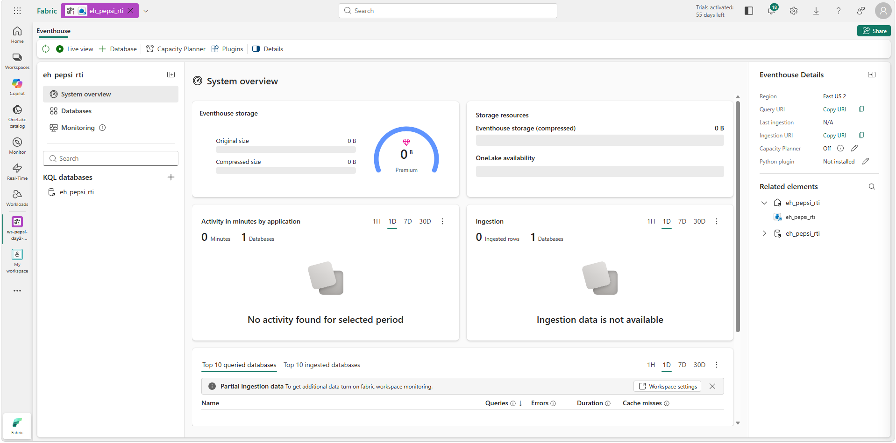
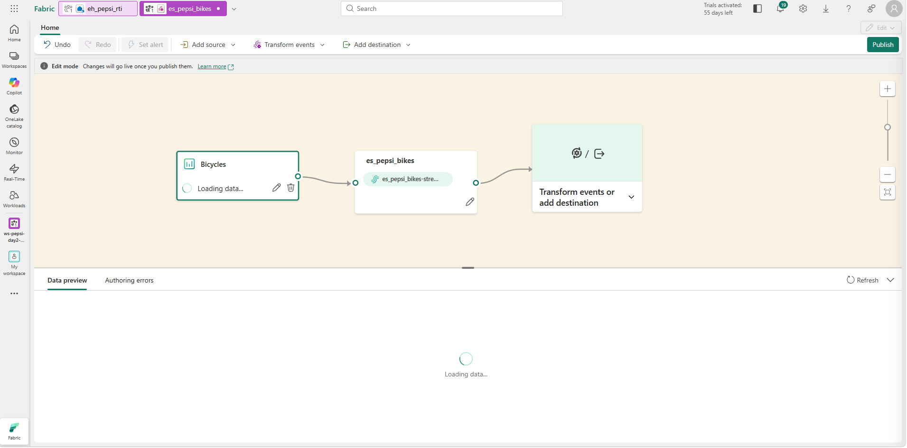
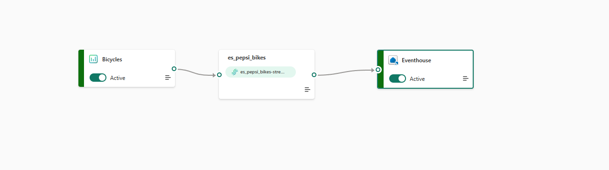
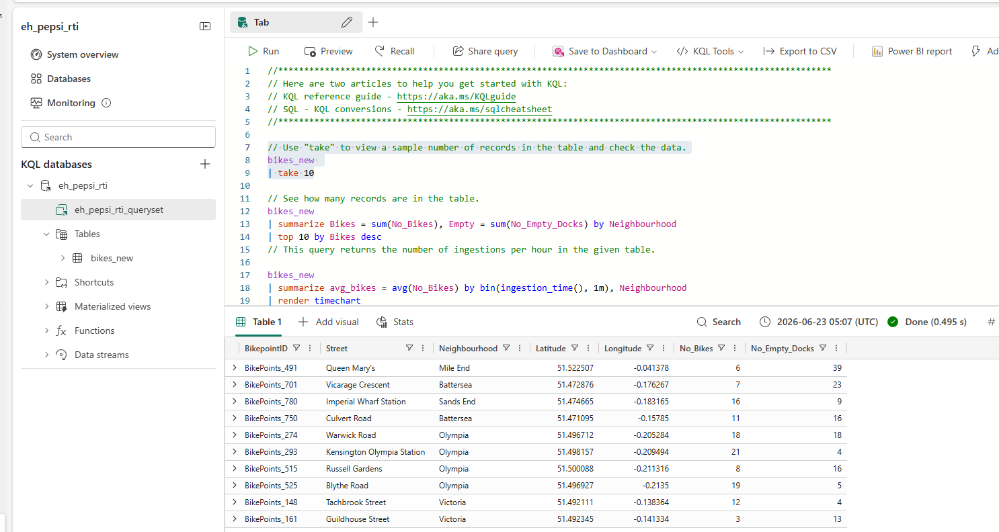
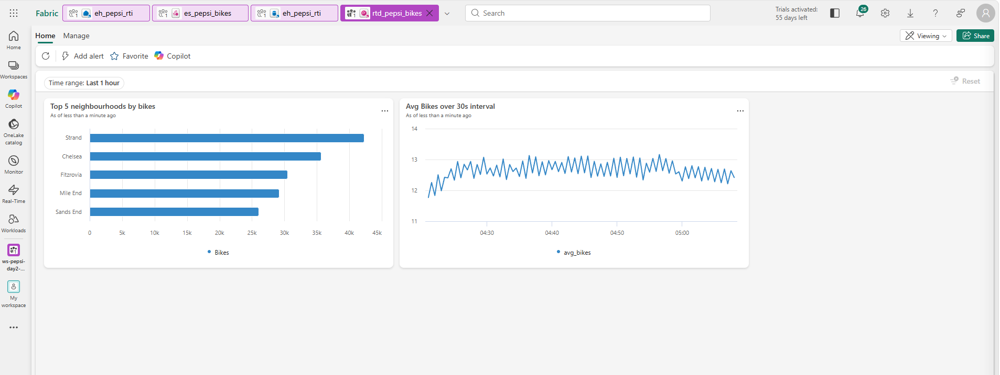
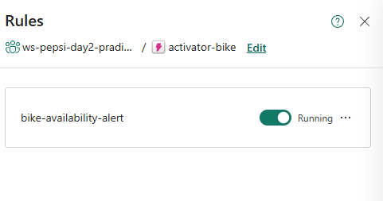

# Lab 02: Real-Time Intelligence in Microsoft Fabric

## Lab introduction

In this lab you learn to build a **Real-Time Intelligence (RTI)** solution in Microsoft Fabric. You will create an **Eventhouse**, ingest a sample streaming source through an **Eventstream**, query the data using **KQL**, and build a **Real-Time Dashboard** with a **data activator alert**.

This lab requires a Microsoft Fabric capacity. The steps work regardless of region.

## Prerequisites — verify before you start

- [ ] You completed **Lab 01** (you have a workspace `ws-pepsi-<yourName>` bound to a Fabric capacity).
- [ ] You can sign in to `https://app.fabric.microsoft.com` with your workshop account.

## Estimated timing: 35 minutes

## Lab scenario

Your retail operations team needs near-real-time visibility into in-store events (bike-share telemetry is used as a stand-in for any IoT signal — imagine store foot traffic, cooler temperature, or shelf-stock sensors). You will land that stream in Fabric, run analytic queries on live data, and raise an alert when a threshold is breached.

## Architecture diagram


## Job skills

- Task 1: Create an Eventhouse and KQL database.
- Task 2: Create an Eventstream and bind it to a destination table.
- Task 3: Explore the data with KQL.
- Task 4: Build a Real-Time Dashboard and a data activator alert.
- Task 5: Validate your work.

---

## Task 1: Create an Eventhouse and KQL database

In this task, you will create an Eventhouse — the storage tier for streaming data in Fabric.

1. Sign in to the **Microsoft Fabric portal** — `https://app.fabric.microsoft.com`.

2. Open the workspace you created in Lab 01 (`ws-pepsi-<yourName>`).

3. Click **+ New item**, search for **Eventhouse**, and select it.

4. **Name** the Eventhouse `eh_pepsi_rti` and click **Create**.

    

5. After the Eventhouse opens, the default KQL database `eh_pepsi_rti` is created automatically. Note the **Query URI** in the **Database details** card — you will use it from KQL queries.

---

## Task 2: Create an Eventstream and bind it to a destination table

In this task, you will create an Eventstream that reads from the **Bicycles** sample source and writes to your Eventhouse.

1. From the workspace, click **+ New item**, search for **Eventstream**, and select it.

2. **Name** the Eventstream `es_pepsi_bikes` and click **Create**.

3. In the Eventstream canvas, click **Add source** (top toolbar) → **Use sample data**. Select **Bicycles** as the sample, then click **Add**.

4. The canvas now shows three nodes: the **Bicycles** source on the left, the **es_pepsi_bikes** stream in the middle, and a **"Transform events or add destination"** placeholder on the right.

    

5. Confirm data is flowing: check the **Data preview** tab at the bottom — you should see rows with columns like `BikepointID`, `Street`, `Neighbourhood`, `No_Bikes`, `No_Empty_Docks`.

6. Click the **"Transform events or add destination"** box on the right. Select **Eventhouse** as the destination. Configure:

    | Setting | Value |
    |---|---|
    | Workspace | `ws-pepsi-<yourName>` |
    | Eventhouse | `eh_pepsi_rti` |
    | Destination table | `bikes_new` (create new) |
    | Input data format | **JSON** |

7. Click **Save**, then click **Publish** (top-right blue button). The banner says *"Changes will go live once you publish them"* — until you publish, data does not flow to the destination.

    

6. In the Eventstream **Data preview** tab, confirm rows are arriving every few seconds.

---

## Task 3: Explore the data with KQL

In this task, you will query the streaming data with KQL.

1. From the workspace, open the `eh_pepsi_rti` Eventhouse. In the top toolbar, click **Query with code** to open the KQL query editor.

2. Run each query in turn and observe the result.

    ```kusto
    bikes_new
    | take 10
    ```

    ```kusto
    bikes_new
    | summarize Bikes = sum(No_Bikes), Empty = sum(No_Empty_Docks) by Neighbourhood
    | top 10 by Bikes desc
    ```

    ```kusto
    bikes_new
    | summarize avg_bikes = avg(No_Bikes) by bin(ingestion_time(), 1m), Neighbourhood
    | render timechart
    ```

    

---

## Task 4: Build a Real-Time Dashboard and a data activator alert

In this task, you will assemble a one-page dashboard and raise an alert when a neighbourhood runs out of bikes.

1. From the workspace, click **+ New item**, search for **Real-Time Dashboard**, name it `rtd_pepsi_bikes`, and click **Create**.

2. The dashboard opens with an **Add a data source** prompt. Under **Suggested from the Workspace**, click **`eh_pepsi_rti`**. This connects the dashboard to your KQL database.

3. Click **+ Add tile**. Paste the following query and click **Apply**:

    ```kusto
    bikes_new
    | summarize Bikes = sum(No_Bikes) by Neighbourhood
    | top 5 by Bikes desc
    ```

4. Change the visualization to **Bar chart**, save the tile, then add a second tile:

    ```kusto
    bikes_new
    | summarize avg_bikes = avg(No_Bikes) by bin(ingestion_time(), 30s)
    | render timechart
    ```

5. Click **Save** to persist the dashboard.

    

6. Select the **bar chart** tile, then click **Add alert** in the top toolbar. In the **Add rule** dialog, configure:

    | Section | Setting | Value |
    |---|---|---|
    | **Details** | Rule name | `bike-availability-alert` |
    | **Monitor** | Source | (auto-filled: `rtd_pepsi_bikes / Top 5 neighbourhoods by bikes`) |
    | | Query | (auto-filled from the tile) |
    | | Run query every | `5 minutes` |
    | **Condition** | Check | **On each event when** |
    | | Grouping field | `Neighbourhood` |
    | | When | `Bikes` |
    | | Condition | **Is less than** |
    | | Value | `2` |
    | | Occurrence | **Every time the condition is met** |
    | **Action** | Select action | **Message to individuals** |
    | | To | Your workshop account |
    | | Headline | `Activator alert` |
    | **Save location** | Workspace | `ws-pepsi-<yourName>` |
    | | Item | **Create a new item** |
    | | New item name | `activator-bikes` (no spaces — spaces may prevent the Create button from activating) |

7. Click **Create**.

    

---

## Task 5: Validate your work

Confirm each item below before moving on.

- [ ] Eventhouse `eh_pepsi_rti` exists with a KQL database.
- [ ] Eventstream `es_pepsi_bikes` is published and data is flowing (preview shows rows).
- [ ] KQL `bikes_new | take 10` returns rows.
- [ ] Real-Time Dashboard `rtd_pepsi_bikes` shows a bar chart and a timechart.
- [ ] Data Activator alert is configured.

✅ **Lab 02 complete** — you now have a working Real-Time Intelligence pipeline. Continue to [**Lab 03 — Vector Search**](./LAB_03-Vector_Search.md).

---

## Review

In this lab you stood up an Eventhouse, ingested a live stream via Eventstream, queried it with KQL, built a Real-Time Dashboard, and wired up a Data Activator alert. The same building blocks apply to any sensor, POS, or transactional stream your team brings into Fabric.

## Troubleshooting

| Symptom | Likely cause | Fix |
|---|---|---|
| Eventstream "no data" | Sample source paused | In the canvas, select the source node → **Start** |
| `bikes_new` table missing | Destination not published | Re-open the Eventstream and click **Publish** |
| KQL query returns 0 rows | Table name mismatch | In the explorer, confirm the table name and quote-case match exactly |
| Alert email not received | Activator action not configured | Open the activator → confirm **Email** action is **Enabled** |

## Further reading

- [Real-Time Intelligence in Microsoft Fabric](https://learn.microsoft.com/fabric/real-time-intelligence/overview)
- [Eventhouse overview](https://learn.microsoft.com/fabric/real-time-intelligence/eventhouse)
- [KQL quick reference](https://learn.microsoft.com/kusto/query/)
- [Data Activator](https://learn.microsoft.com/fabric/data-activator/data-activator-introduction)
